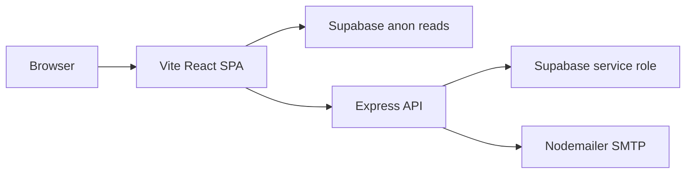

<div align="center">

# Valitsa Travel

**A bilingual luxury travel marketing site and admin operations platform** — cinematic trip discovery, faceted search, inquiry conversion with CAPTCHA + SMTP, and a Supabase-backed staff console for trips, leads, and seasonal navigation.

[](https://valitsatravel.gr)
[](https://www.typescriptlang.org/)
[](https://react.dev/)
[](https://vitejs.dev/)
[](https://expressjs.com/)
[](https://supabase.com/)
[](https://tailwindcss.com/)
[](https://vitest.dev/)

**Live:** [valitsatravel.gr](https://valitsatravel.gr)

<!-- Banner: add a hero screenshot at docs/banner.png and uncomment the line below -->
<!--  -->

*Portfolio-grade production build — opinionated UX, disciplined security, deployable on managed hosting.*

</div>

---

## Key Features

### Public experience

- **Bilingual GR/EN surface** — Language context with persisted preference; trip copy, legal modals (Terms, About, Payment Methods), and admin labels share one i18n layer so marketing and operations stay aligned.
- **Cinematic trip discovery** — Hero landing, featured trips, and a data-rich **trips archive** with faceted filters, URL-driven presets, and instant scroll restoration between routes (`useLayoutEffect` + location key) so navigation never feels “stuck.”
- **Immersive trip detail** — Full-screen modal with gallery, justified rich-text description, itinerary timeline, included/not-included lists, optional pricing-by-departure cards, flight legs, and a conditional **participation** tab when staff fill bilingual HTML in admin.
- **Conversion pipeline** — Contact modal and per-trip inquiry forms with **Cloudflare Turnstile** (or reCAPTCHA), Zod-validated payloads, SMTP confirmation via Nodemailer, and optional persistence to Supabase `inquiries`.
- **Trust & SEO** — `react-helmet-async` for canonical/OG/JSON-LD; DOMPurify allowlists for CMS HTML; dark mode via `next-themes` with OS-aware motion reduction (`MotionConfig reducedMotion="user"`).

### Admin & operations

- **Role-gated console** (`/admin/*`) — Supabase Auth JWT verified server-side; `profiles.role === "admin"` on every `/api/admin/*` route.
- **Trip editor** — React Hook Form + Zod, TipTap rich text, nested modals for departure windows, pricing segments, and flight details; **unsaved-changes guard** on dismiss (overlay, Escape, X) via shared `useUnsavedDialogClose` + bilingual 3-choice alert.
- **Leads workspace** — Inquiry timeline, status workflow, rich-text staff comments, and attachment uploads to Supabase Storage with path validation.
- **Seasonal navigation** — CRUD for `seasonal_configs` drives navbar season links; orphan detection when trips reference keys without config rows.
- **Analytics** — `POST /api/track-click` records trip engagement through a Supabase RPC (rate-limited).

### Engineering highlights (why it feels fast)

| Technique | Location | Impact |
| --------- | -------- | ------ |
| Route-level code splitting | [`src/App.tsx`](src/App.tsx) — `React.lazy` for Index, Trips, admin pages | Smaller initial bundle; heavy routes load on demand inside `Suspense`. |
| Vendor chunk strategy | [`vite.config.ts`](vite.config.ts) — `manualChunks` | Splits `react-vendor`, `motion-vendor`, `router-vendor`, `radix-vendor`, `vendor` for cache-friendly parallel downloads. |
| Progressive imagery | [`src/components/ProgressiveImage.tsx`](src/components/ProgressiveImage.tsx) | `IntersectionObserver` with `rootMargin: "400px"`; LQIP blur; tuned `fetchPriority` for hero vs below-fold. |
| CDN-aware URLs | [`src/lib/utils.ts`](src/lib/utils.ts) — `optimizeImageUrl`, `buildResponsiveImageSet` | Width/format/quality params for responsive `srcset`. |
| Modal scroll lock | [`src/hooks/useScrollLock.ts`](src/hooks/useScrollLock.ts) | Prevents background scroll while trip detail, contact, or legal overlays are open. |

---

## Architecture & Tech Stack



This is a **Vite 8 + React 18** SPA with a **Node / Express 5** API — not Next.js. Routing uses **React Router v6**. Production targets **cPanel / Phusion Passenger** with rsync-based release automation ([`.cpanel.yml`](.cpanel.yml), [`passenger_entry.cjs`](passenger_entry.cjs)).

| Layer | Technologies |
| ----- | ------------ |
| **Frontend** | React 18, TypeScript 5.8, Vite 8, Tailwind CSS 3, Radix UI, Framer Motion, React Router 6, TanStack Query, React Hook Form + Zod, TipTap, DOMPurify, Lucide |
| **Backend** | Express 5, Zod 4, Helmet, CORS, express-rate-limit + express-slow-down, Multer, Sharp (WebP pipeline), Nodemailer |
| **Data & auth** | Supabase (PostgreSQL, Storage, Auth); browser uses anon key; API uses service role for admin writes, inquiries, seasonal nav, analytics |
| **DevOps** | cPanel Passenger, `npm run verify:deploy`, `npm run verify:api-health`; dev proxy from Vite to `API_PORT` (default `8787`) |

### Why this stack

- **SPA + thin API** fits shared hosting: static Vite assets plus a stateless Express process behind Passenger, without SSR complexity.
- **Supabase** delivers Postgres, auth, and storage without a custom ORM — ideal for a CMS-like trip catalog and staff workflows.
- **Zod at boundaries** (inquiry payloads, admin trip PUT, track-click) keeps runtime validation aligned with TypeScript types on the client.

---

## Getting Started

### Prerequisites

- **Node.js** 18+ (20 LTS recommended)
- **npm** 9+
- A **Supabase** project (URL + anon key + service role key)
- **SMTP** credentials and a **Turnstile** (or reCAPTCHA) secret for production inquiry flows

### 1. Clone and install

```bash
git clone https://github.com/YOUR_ORG/Valitsa-Travel.git
cd Valitsa-Travel
npm ci
```

### 2. Environment variables

Copy the examples and fill in your values. **Never commit** real secrets or the Supabase service role key.

**Root [`.env.example`](.env.example) → `.env`**

| Variable | Purpose |
| -------- | ------- |
| `VITE_SUPABASE_URL` | Supabase project URL (browser + server) |
| `VITE_SUPABASE_ANON_KEY` | Public anon key for client reads |
| `VITE_MAIL_API_URL` | Inquiry API URL (dev: `http://localhost:8787/api/send-inquiry`) |
| `VITE_TURNSTILE_SITE_KEY` | Cloudflare Turnstile site key (or `VITE_RECAPTCHA_SITE_KEY`) |
| `VITE_SHOW_TRIPS` | `true` / `false` — hide trip listings when `false` |
| `SUPABASE_SERVICE_ROLE_KEY` | Server-only; can live here or in `server/.env` |

**[`server/.env.example`](server/.env.example) → `server/.env`**

| Variable | Purpose |
| -------- | ------- |
| `API_PORT` | API listen port (default `8787`) |
| `CORS_ORIGIN` | Comma-separated allowed origins (required in production) |
| `MAIL_HOST`, `MAIL_PORT`, `MAIL_USER`, `MAIL_PASS`, `MAIL_TO` | SMTP for inquiry emails |
| `TURNSTILE_SECRET_KEY` | CAPTCHA verification (production inquiries) |
| `SUPABASE_SERVICE_ROLE_KEY` | Admin routes, inquiries DB, seasonal nav, analytics |

Apply SQL migrations under [`supabase/migrations/`](supabase/migrations/) in the Supabase SQL editor (e.g. seasonal navigation, trip participation columns).

### 3. Run locally

```bash
npm run dev
```

- **Web:** [http://localhost:5180](http://localhost:5180) (Vite)
- **API:** [http://localhost:8787](http://localhost:8787) (Express; proxied from Vite for `/api`)

Other useful commands:

| Command | Purpose |
| ------- | ------- |
| `npm run dev:api` | API only |
| `npm run build` | Production client bundle (runs env check first) |
| `npm run start:api` | Production API process |
| `npm test` | Vitest unit tests |
| `npm run verify:api-health` | Smoke-test `GET /api/health` on deployed API |

### Production / cPanel

See [`HOSTING_PASSENGER.txt`](HOSTING_PASSENGER.txt) when `/api` does not reach Node. If the host reports `vite: command not found` during build:

```bash
npm run build:cpanel
```

Equivalent to `npm ci --include=dev` then `npm run build`. Do not set `NODE_ENV=production` before installing devDependencies for the build step.

<details>
<summary><strong>cPanel build notes</strong></summary>

- Use `npm ci --include=dev` before `npm run build` so Vite and TypeScript are available.
- After build, you may run `npm prune --omit=dev` if your host separates build and runtime phases.
- Post-deploy: `npm run verify:deploy` and `npm run verify:api-health` (must return JSON `{"ok":true}`).

</details>

---

## Database Schema & API Overview

### Core data models (Supabase)

| Table | Role |
| ----- | ---- |
| `trips` | Catalog: bilingual text/HTML, `text[]` tags/gallery/transport, JSONB `departure_windows`, `pricing_segments`, `flight_details`, featured/status/seasonal flags |
| `inquiries` | Lead records from public forms (status: `new` \| `contacted` \| `resolved`) |
| `inquiry_comments` | Staff notes on inquiries; optional `attachments` JSON |
| `profiles` | Auth users; `role` gate for admin (`admin`) |
| `seasonal_configs` | Navbar season labels (EL/EN), display order, active flag |
| `analytics_events` | Trip click/impression aggregates (via RPC from API) |

**Storage buckets:** `trip-images` (admin uploads, Sharp → WebP), `inquiry-attachments` (lead comment files).

Trip types and JSONB shapes are documented in [`src/types/Trip.ts`](src/types/Trip.ts).

### Public API (Express)

| Method | Path | Description |
| ------ | ---- | ----------- |
| `GET` | `/api/health`, `/health` | Liveness + `inquiries_db` flag |
| `GET` | `/api/seasonal-nav` | Active season links for navbar |
| `POST` | `/api/send-inquiry`, `/send-inquiry` | Validated inquiry + CAPTCHA + email (rate-limited) |
| `POST` | `/api/track-click` | Record trip card click analytics |

### Admin API (Bearer JWT + `profiles.role === admin`)

| Method | Path | Description |
| ------ | ---- | ----------- |
| `POST` | `/api/admin/upload-image` | Multipart image → WebP → Supabase Storage |
| `POST` | `/api/admin/trips` | Create trip (Zod `adminTripPutSchema`) |
| `PUT` | `/api/admin/trips/:id` | Full trip update |
| `PATCH` | `/api/admin/trips/:id` | Toggle `is_featured` |
| `GET` | `/api/admin/seasonal-configs` | List configs + trip counts / orphans |
| `POST` | `/api/admin/seasonal-configs` | Create season |
| `PUT` | `/api/admin/seasonal-configs/:key` | Update season labels/order/active |
| `DELETE` | `/api/admin/seasonal-configs/:key` | Delete season (unlinks trips) |
| `GET` | `/api/admin/inquiries/:id/comments` | Comment thread |
| `POST` | `/api/admin/inquiries/:id/comments` | Add staff comment + attachments |
| `PATCH` | `/api/admin/inquiries/:id` | Update inquiry status |
| `PATCH` | `/api/admin/inquiries/:inquiryId/comments/:commentId` | Remove attachment from comment |

### Admin session policy

Admin auth uses Supabase **access JWT** + **refresh token**. The browser client (`autoRefreshToken: true`) renews credentials silently; admins should not need to re-enter their password on a normal workday.

**05:00 Greece daily refresh (client-side):** Supabase cannot set “expire at 05:00 Europe/Athens” in the dashboard. The app schedules `refreshSession()` at the next **05:00 `Europe/Athens`** and when the tab becomes visible after that boundary ([`src/admin/components/AdminSessionKeepAlive.tsx`](src/admin/components/AdminSessionKeepAlive.tsx), [`src/admin/lib/athensSessionSchedule.ts`](src/admin/lib/athensSessionSchedule.ts)). Each refresh issues a new access token; combined with a long refresh-token lifetime, this approximates a 24h roll without showing the login form.

**Supabase Dashboard (project ops):**

1. **Authentication → Settings** (or JWT / session settings): set **JWT expiry** for access tokens (e.g. `3600` seconds). Short access tokens are fine when refresh is reliable.
2. Set **refresh token expiry** as long as your policy allows (e.g. 30–90 days) so daily rotation does not force email/password login.
3. Do not disable refresh tokens for admin users.

**In-app protections while editing:** [`adminFetch`](src/lib/adminApi.ts) retries once after `refreshSession()` on 401; if still unauthorized and a form is dirty, the user sees a warning toast and stays on the page (no forced redirect). Background React Query refetch is paused while admin forms are dirty. If the session is fully gone during an edit, [`AdminGuard`](src/admin/components/AdminGuard.tsx) keeps the page mounted with a banner until the user signs in again (unsaved work remains in memory only — there is no draft autosave).

---

## Key Technical Challenges & Lessons Learned

### 1. Nested admin editors without losing work

Trip editing uses a full-screen dialog plus nested modals (departure dates, pricing, flights). Dismissing via overlay click or Escape previously dropped in-memory drafts. The fix is a shared **[`useUnsavedDialogClose`](src/admin/hooks/useUnsavedDialogClose.ts)** hook and **[`UnsavedCloseAlert`](src/admin/components/UnsavedCloseAlert.tsx)** — a bilingual three-choice dialog (keep editing / leave without saving / save and close) wired across `TripEditDialog`, inquiry detail, seasonal create, and sub-modals. **Lesson:** intercept `Dialog.Root` `onOpenChange(false)` once at the root; keep dirty detection explicit per surface (RHF `isDirty`, JSON snapshot, or draft vs saved status).

### 2. Modeling real-world trip inventory in JSONB

Travel products need per-month departure days, priced room tiers per departure, optional flight legs, and bilingual HTML — not flat columns. The app stores structured JSONB on `trips`, normalizes legacy shapes on read ([`src/lib/tripAdminForm.ts`](src/lib/tripAdminForm.ts)), and validates writes with a strict Zod schema on the server ([`server/adminRoutes.js`](server/adminRoutes.js)). **Lesson:** invest in shared client types ([`src/types/Trip.ts`](src/types/Trip.ts)) and one server schema so the admin UI and API cannot drift.

### 3. Shipping Node ESM on Passenger + static SPA

Hosting constraints required a CommonJS bridge ([`passenger_entry.cjs`](passenger_entry.cjs)) that dynamic-imports ESM [`server/index.js`](server/index.js), strict production CORS (empty `CORS_ORIGIN` throws), and health checks that prove `/api` returns JSON not HTML. **Lesson:** treat “API reachable” as a deploy artifact (`verify:api-health`), not an assumption.

### Security (evidence-based)

| Layer | Mechanism |
| ----- | --------- |
| Transport & headers | Helmet, HSTS in production, `app.disable("x-powered-by")` |
| Origin control | CORS allow-list; production requires `CORS_ORIGIN` |
| Input validation | Zod on inquiries, track-click, admin trip bodies |
| Abuse control | Rate limiters + slowdown on hot paths |
| HTML injection | DOMPurify allowlist for public rich text |
| Admin surface | Bearer JWT → `getUser` + `profiles.role` gate |

Rich HTML from the editor is sanitized in [`src/lib/sanitizeTripRichTextHtml.ts`](src/lib/sanitizeTripRichTextHtml.ts) and rendered via [`src/components/SafeRichTextHtml.tsx`](src/components/SafeRichTextHtml.tsx).

---

## Future Roadmap

- **End-to-end tests** — Playwright coverage for inquiry submission, trip detail tabs, and admin save/discard flows.
- **Inquiry SLA dashboard** — Admin metrics for time-to-first-response and status funnel by season/trip.
- **Deeper booking integration** — Optional deposit/hold flow or external booking provider webhook (without replacing the current inquiry-first conversion model).

---

## License & Contact

This project is licensed under the **[Educational Use Only License](LICENSE)** (© 2026 Athanasios Oikonomou). Commercial use requires explicit written permission from the copyright holder.

| Channel | Link |
| ------- | ---- |
| **LinkedIn** | [Athanasios Oikonomou](https://www.linkedin.com/in/ath-oik) |
| **Email** | ath.oikonomou@hotmail.com |

---

<p align="center"><sub>Built with intent. Shipped with care. <strong>Valitsa Travel</strong> — premium travel, engineered.</sub></p>
